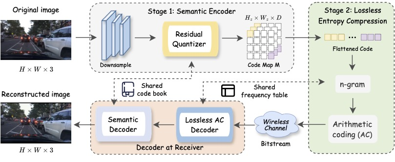

# Residual Quantization with N-gram–driven Arithmetic Coding (RQ-NAC)

<p align="center">
  
</p>

RQ-NAC is a two-stage semantic compression framework designed for efficient visual data transmission over bandwidth-constrained channels. The pipeline integrates **Residual Quantization (RQ)** with **N-gram–driven Arithmetic Coding (NAC)**.

- **RQ-based Encoder**: Generates compact discrete semantic representations, expanding representational capacity exponentially with quantization depth.
- **Context-adaptive Entropy Module**: Removes redundancy in latent indices via N-gram modeling for lossless compression.

RQ-NAC achieves compression ratios exceeding **600×** relative to the uncompressed RGB image size while maintaining strong perceptual quality.

---

## Profiling Result

The profiling results report the average inference time per image under an edge-device setting to simulate practical deployment conditions.

Experiments are conducted on an edge device equipped with an NVIDIA RTX 5080 Laptop GPU and an Intel Core Ultra 9 275HX CPU.

### Compress (Encode)

| Depth | RQ-VAE (ms) | NAC (ms) |
|-------|------------|----------|
| x4    | 119.0571   | 15.7462  |
| x8    | 120.4951   | 22.8375  |
| x16   | 120.2094   | 36.4351  |


### Restore (Decode)

| Depth | RQ-VAE (ms) | NAC (ms) |
|-------|------------|----------|
| x4    | 196.3354   | 114.7885  |
| x8    | 195.2968   | 205.2417  |
| x16   | 195.3817   | 475.0927  |


## RQ-VAE Architecture

### Encoder
| Stage | Block pattern | Channels (in→out) | Attn | Downsample |
|-----------|----------------|-------------------|------|------------|
| conv_in   | Conv 3×3       | 3 → 128           | No   | No |
| down[0]   | 2× ResBlock    | 128 → 128         | No   | stride-2 conv |
| down[1]   | 2× ResBlock    | 128 → 128         | No   | stride-2 conv |
| down[2]   | 2× ResBlock    | 128 → 256         | No   | stride-2 conv |
| down[3]   | 2× ResBlock    | 256 → 256         | No   | stride-2 conv |
| down[4]   | 2× ResBlock    | 256 → 512         | Yes  | stride-2 conv |
| down[5]   | 2× ResBlock    | 512 → 512         | No   | No |
| mid       | ResBlock → Attn → ResBlock | 512 → 512 | Yes | No |
| out       | GN + Conv 3×3  | 512 → 256         | No   | No |

### Quantizer (RQ bottleneck)
| Component | Spec |
|----------|------|
| quant_conv / post_quant_conv | 1×1 conv (256→256) |
| RQ codebooks | 4 × VQEmbedding (K=2048, D=256) |

### Decoder
| Stage | Block pattern | Channels (in→out) | Attn | Upsample |
|----------|----------------|-------------------|------|----------|
| conv_in  | Conv 3×3       | 256 → 512         | No   | No |
| mid      | ResBlock → Attn → ResBlock | 512 → 512 | Yes | No |
| up[5]    | 3× ResBlock    | 512 → 512         | No   | Yes (conv upsample) |
| up[4]    | 3× ResBlock    | 512 → 512         | Yes  | Yes (conv upsample) |
| up[3]    | 3× ResBlock    | 512 → 256         | No   | Yes (conv upsample) |
| up[2]    | 3× ResBlock    | 256 → 256         | No   | Yes (conv upsample) |
| up[1]    | 3× ResBlock    | 256 → 128         | No   | Yes (conv upsample) |
| up[0]    | 3× ResBlock    | 128 → 128         | No   | No |
| out      | GN + Conv 3×3  | 128 → 3           | No   | No |


---

## Environment

```bash
# Create Conda environment
conda create -n rqnac python=3.10.18
conda activate rqnac

# Install PyTorch
pip install torch torchvision

# Install project dependencies
pip install -r requirements.txt

```


---


## Training and Evaluation of RQ-VAE

**Dataset**

Download the dataset from Kaggle and extract it to:

rq-vae/data/vehicle

Primary dataset:
https://www.kaggle.com/datasets/mdfahimbinamin/100k-vehicle-dashcam-image-dataset


Project directory should look like:

```bash
rq-vae/
└── data/
    └── vehicle/
        ├── train/        # Training set for model training
        ├── val/          # Validation / inference set
        └── test/
```

Case Study

To run a case study, simply replace all the images in:

rq-vae/data/vehicle/val

Case study dataset (Car Crash):
https://www.kaggle.com/datasets/asefjamilajwad/car-crash-dataset-ccd

**Train and Evaluate**

```bash

# Go to RQ-VAE folder
cd rq-vae

# Train RQ-VAE
torchrun --standalone --nnodes=1 --nproc_per_node=8   main_stage1.py -m=$CONFIG_DIR -r=$SAVE_DIR

# Example
torchrun --standalone --nnodes=1 --nproc_per_node=8   main_stage1.py -m=configs/vehicle/stage1/vehicle-rqvae-23x40x4.yaml -r=output/vehicle

# Evaluate RQ-VAE
python compute_recon.py --split=val --vqvae=$RQVAE_CKPT

# Example
python compute_recon.py --split=val --vqvae output/vehicle-rqvae-23x40x4/epoch145_model.pt

```

The quantized codes generated by RQ-VAE will be saved under:

rq-vae/code/

nac/data/ contains RQ-VAE generated codes from different configurations and can be used by NAC

---


## Training and Evaluation of NAC

```bash

# Go to NAC folder

cd nac

# Run NAC

python nac.py

```

To run different NAC configurations, modify the following parameters inside the script:

```bash

# N-gram order
N = 2

# K smoothing constant
K = 0.1

# Depth of RQ-VAE codes
D = 8

```

The script will load data/codes23x40xD.txt and construct an N-gram frequency table using smoothing factor K.


---


**Acknowledgement**

This project uses the RQ-VAE Transformer implementation from KakaoBrain:

https://github.com/kakaobrain/rq-vae-transformer

The NAC implementation is inspired by the following open-source projects:

https://github.com/gustavecortal/ngram

https://github.com/tommyod/arithmetic-coding
